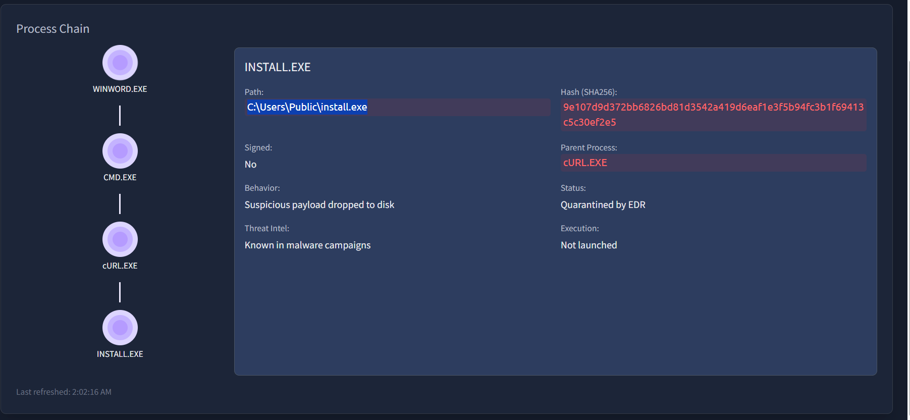
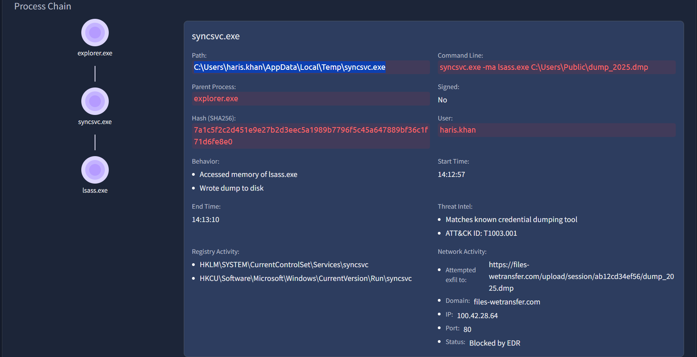
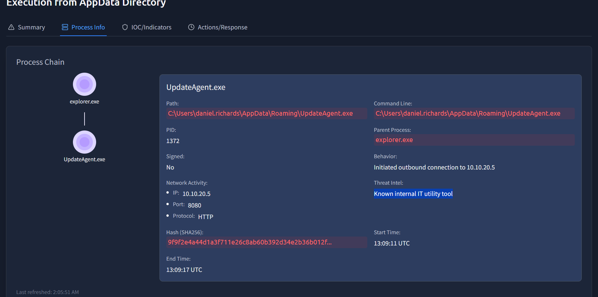
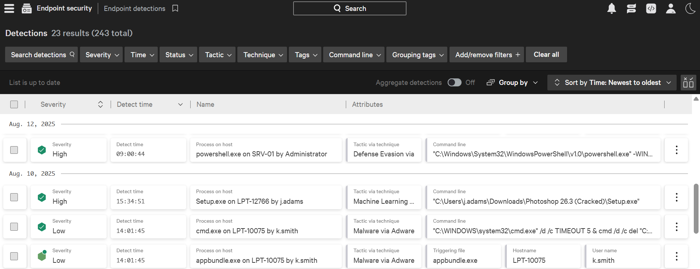

# [Introduction to EDR](https://tryhackme.com/room/introductiontoedrs) – SOC Investigation Lab


## Lab Overview

This lab focused on understanding the fundamentals of Endpoint Detection and Response (EDR), including telemetry collection, behavioral detections, attack chain visibility, and incident response capabilities.

The investigation simulated realistic SOC analyst workflows using an EDR dashboard to triage alerts, analyze process trees, investigate endpoint telemetry, and validate suspicious activity.

---

## Platform

- TryHackMe

---

## Objectives

- Understand how EDR differs from traditional Antivirus solutions
- Learn how EDR agents and sensors collect telemetry
- Investigate endpoint activity using EDR telemetry
- Analyze suspicious process chains
- Understand EDR detection methodologies
- Perform SOC alert triage using an EDR dashboard

---

## Skills Demonstrated

- SOC alert triage
- Endpoint telemetry analysis
- Parent-child process analysis
- Threat detection analysis
- IOC investigation
- Process tree investigation
- Network connection analysis
- Threat intelligence validation
- MITRE ATT&CK mapping
- Detection and response concepts

---

## EDR Concepts Learned

### Visibility

EDR solutions provide detailed visibility into endpoint activity, including:

- Process execution
- File modifications
- Registry changes
- Network connections
- User activity
- Command-line execution

This telemetry enables analysts to reconstruct attacker activity and investigate suspicious behavior in depth.

---

### Detection

The lab demonstrated several modern EDR detection techniques:

- Behavioral Detection
- Anomaly Detection
- IOC Matching
- Machine Learning-Based Detection
- MITRE ATT&CK Mapping

Unlike traditional antivirus solutions, EDR platforms analyze behavioral patterns and attack chains rather than relying solely on malware signatures.

---

### Response Capabilities

The EDR platform supported several response actions:

- Host isolation
- Process termination
- File quarantine
- Remote endpoint access
- Artifact collection

These response mechanisms allow SOC analysts to rapidly contain and investigate threats.

---

## Investigation Scenario

The lab simulated multiple endpoint detections requiring triage and investigation through the EDR console.

The investigation focused on:
- malicious Office macro activity
- suspicious PowerShell execution
- malware downloads
- credential dumping behavior
- outbound exfiltration attempts
- threat intelligence validation

---

# Detection Analysis

## Detection 1 — DESKTOP-HR01

### Observed Process Chain

```text
WINWORD.EXE
↓
CMD.EXE
↓
cURL.EXE
↓
install.exe
```

### Investigation Findings



A malicious macro-enabled Word document (`invoice.docm`) spawned `CMD.EXE`, which launched `cURL.EXE` to download a payload from a remote server.

The payload was saved as:

```text
C:\Users\Public\install.exe
```

The EDR successfully quarantined the payload before execution.

### Analyst Assessment

This activity strongly indicates a phishing-based malware delivery chain using malicious Office macros and command-line payload retrieval.

The use of:
- `WINWORD.EXE → CMD.EXE`
- `CMD.EXE → cURL.EXE`

represents suspicious parent-child process relationships commonly observed during malware execution.

### Potential MITRE ATT&CK Mapping

| Tactic | Technique |
|---|---|
| Initial Access | Phishing |
| Execution | Command and Scripting Interpreter |
| Command and Control | Ingress Tool Transfer |

---

## Detection 2 — WIN-ENG-LAPTOP03

### Investigation Findings



The endpoint executed an unsigned binary:

```text
C:\Users\haris.khan\AppData\Local\Temp\syncsvc.exe
```

The process accessed `lsass.exe` and attempted to dump memory, indicating credential dumping behavior.

The process also initiated outbound traffic to:


```text
https://files-wetransfer.com/upload/session/ab12cd34ef56/dump_2025.dmp
```

### Analyst Assessment

The execution of an unsigned binary from the Temp directory combined with LSASS memory access strongly suggests credential theft activity.

The outbound upload activity further indicates potential exfiltration of stolen credentials or sensitive data.

### Potential MITRE ATT&CK Mapping

| Tactic | Technique |
|---|---|
| Credential Access | OS Credential Dumping |
| Exfiltration | Exfiltration Over Web Service |
| Defense Evasion | Masquerading |

---

## Detection 3 — DESKTOP-DEV01

### Investigation Findings


The executable:

```text
C:\Users\daniel.richards\AppData\Roaming\UpdateAgent.exe
```

generated suspicious activity indicators due to outbound connections and lack of a digital signature.

However, Threat Intelligence enrichment identified the executable as:



```text
Known internal IT utility tool
```

### Analyst Assessment

This detection was determined to be benign after threat intelligence validation.

This demonstrates the importance of contextual analysis during SOC investigations, as not all detections are malicious.

---

## Key Takeaways

- EDR provides significantly deeper endpoint visibility compared to traditional antivirus solutions.
- Parent-child process relationships are critical during investigations.
- Behavioral detections help identify advanced threats and fileless attacks.
- Telemetry correlation enables attack chain reconstruction.
- Threat intelligence enrichment assists in validating suspicious activity.
- SOC analysts must distinguish between malicious activity, false positives, and legitimate internal tooling.

---

## Screenshots

### EDR Dashboard Overview


Overview of endpoint detections, CrowdScore metrics, and detection trends inside the EDR console.

---

### Endpoint Detection Queue


Detection queue showing multiple alerts with severity levels, tactics, techniques, and suspicious command-line activity.

---

### Process Tree Investigation


Visualization of malicious parent-child process relationships used during investigation and attack chain reconstruction.

---

### Falcon Real Time Response (RTR)


Example of remote endpoint response capabilities available through the EDR platform for investigation and containment.

---


## Tools & Technologies

- Endpoint Detection & Response (EDR)
- Threat Intelligence
- MITRE ATT&CK Framework
- Endpoint Telemetry Analysis
- Process Tree Analysis

---

## Conclusion

This lab provided practical exposure to EDR investigations and modern SOC analyst workflows. The investigation demonstrated how endpoint telemetry, behavioral detections, and process analysis enable analysts to identify and investigate malicious activity effectively.

The room also reinforced the importance of contextual analysis, threat intelligence validation, and attack chain visibility during real-world incident investigations.
