# [Investigating Windows](https://tryhackme.com/room/investigatingwindows) - TryHackMe Writeup 

## Abstract

This lab focuses on investigating a compromised Windows Server environment using native tools such as Event Viewer, Task Scheduler, and system logs. The objective is to identify attacker activity, persistence mechanisms, and indicators of compromise (IOCs).

## Objectives

- Analyze Windows Event Logs for suspicious activity

- Identify unauthorized access attempts

- Detect privilege escalation

- Investigate persistence mechanisms

- Extract attacker indicators (IP, tools, ports, files)

## Tools & Techniques Used 

- Windows Event Viewer (Security & System Logs)

- Task Scheduler

- Local Users and Groups

- Command Prompt (netstat)

- File system & script inspection

## Lab Environment
- OS: Windows Server 2016
  
- Access Method: RDP
  

 ## Investigation Walkthrough
 
1. System Information Enumeration

The system version was identified using the winver command. 

                  Start → Run → winver

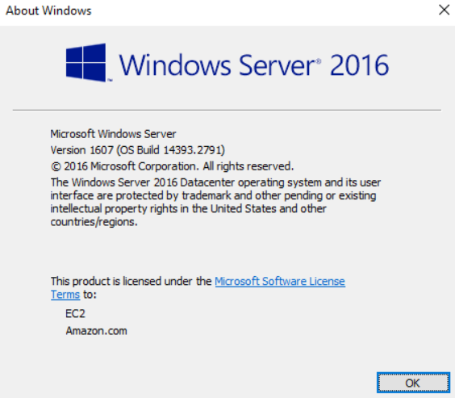

ANS: Windows Server 2016

2. Last Logged-in User

Navigate to: 

                              Event Viewer → Windows Logs → Security
                              

Filter for Event ID: 4624 (Windows Event ID 4624 indicates a successful logon attempt in the Windows Security Log) and sort logs by most recent. 

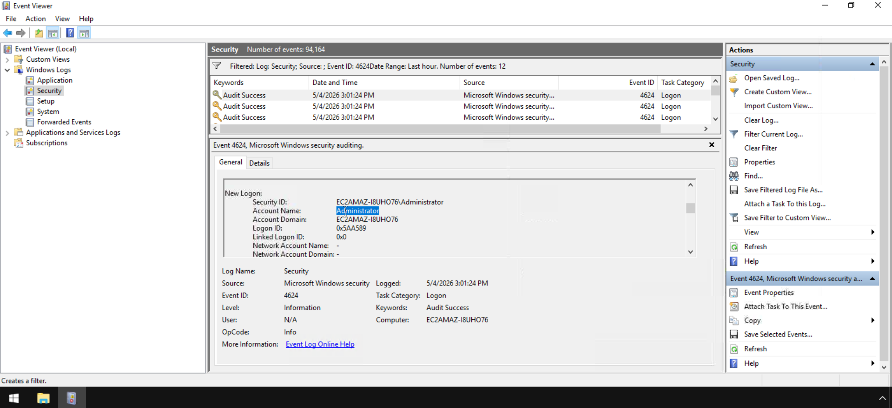

ANS: Administrator

3. User Logon Analysis (John)

To determine John's last login, Filter Event ID: 4624 and Search for user "John". If you're unable to find the user "John", as I went through the same issue, try the following: 

Filter Current Log → XML tab

Tick Edit query manually and manually edit the query like give below: 

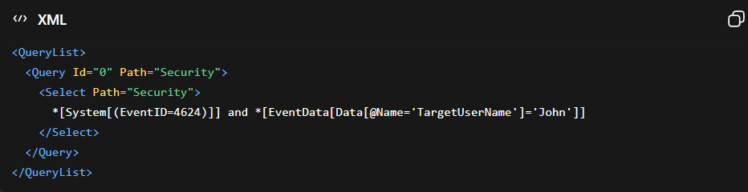

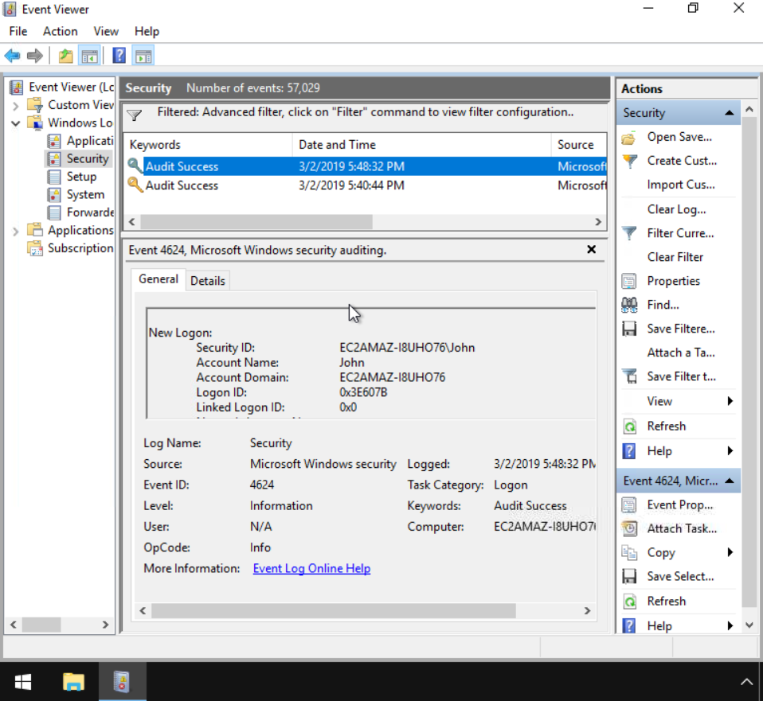

ANS: 03/02/2019 5:48:32 PM

4. Network Activity at Startup (What IP does system connect to on startup?)

look at the host file to see if the answer can be found in the host file. 
The file path is, 

             C:\ > Windows > System32 > drivers > etc, 
             
once in this folder double-click on the hosts file.

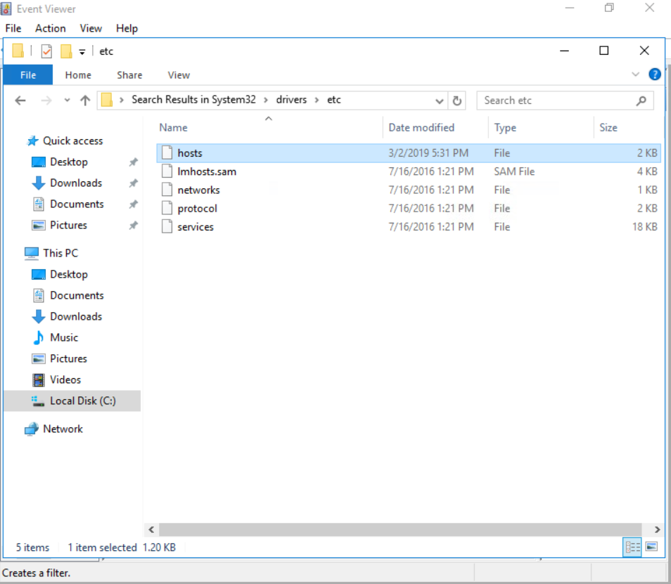

Double-click on hosts to open it, a window will pop up with How do you want to open this file?. Click on Notepad.

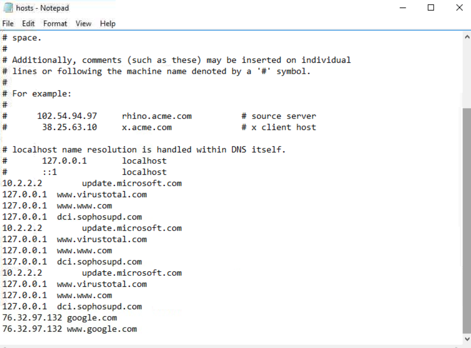

Inside this file, we can see something is off about it. To start, a lot of the sites are pointed at the local host, and secondly google is in here. Seems like some kind of DNS poisoning is going on. If we had a backup copy or could revert to a previous state, then we would definitely know. We should go to the Registry and see if we can discover where this start up program is connecting too.

Now, click start and type regedit and press enter. Follow the path:

            HKEY_LOCAL_MACHINE > SOFTWARE > Microsoft > Windows > CurrentVersion > Run

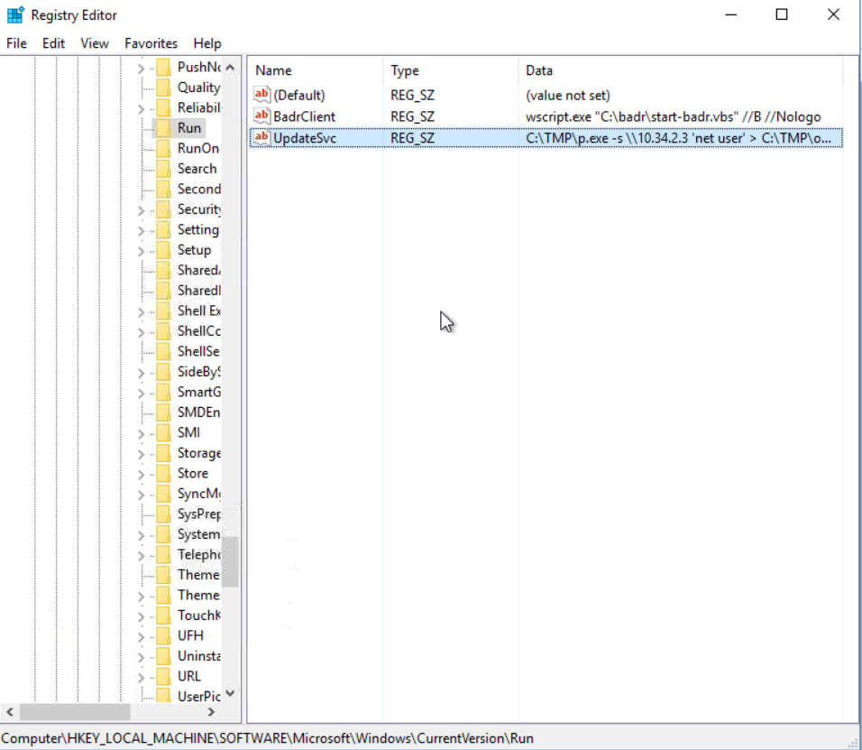

ANS: 10.34.2.3

5. Administrative Privileged Accounts

   Open Command prompt and use the command,

       net localgroup Administrators

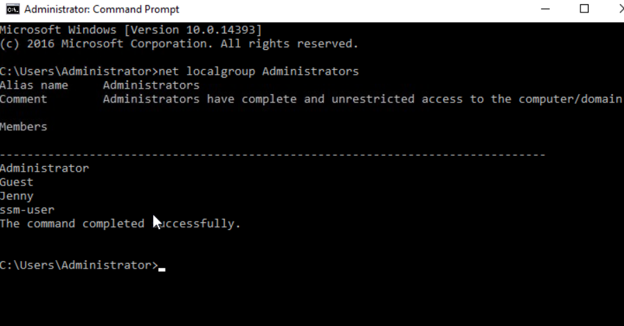

ANS: Guest, Jenny

6. Persistence Mechanism (Scheduled Task)

  Go to:
  
    Start → Search → Task Scheduler

  Expand:

    Task Scheduler Library

  After looking through the list of tasks, identifying the suspicious traits like Weird or generic names, checking triggers, actions, author, & location tab for additional info, A suspicious task named “Clean file system” was identified. The task was configured to execute a PowerShell script (nc.ps1), indicating potential malicious activity and persistence established by the attacker.

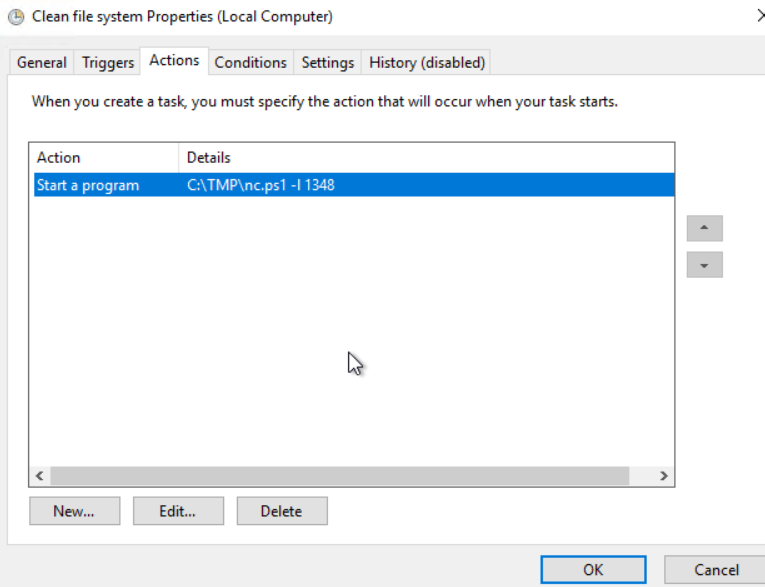

ANS: Clean file system

7. Malicious Script Execution

   The file the the task was trying to run daily is,

ANS: nc.ps1

8. Backdoor Port Identification

    The port that this file listen locally for is, 

ANS: 1348

9. User Jenny last logon check

             Start → Search → cmd
   Type in:

             net user Jenny

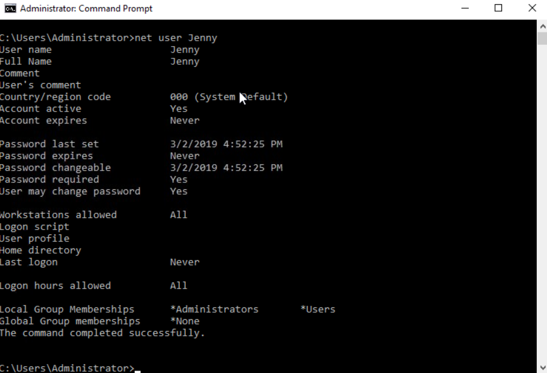

ANS: Never

10. Time of compromise

    Look through the above command prompt

ANS: 03/02/2019

11. Privilege Escalation Detection

    Go to:

         Event Viewer → Windows Logs → Security 

    Filter Event ID: 4672 (Special privileges assigned to a new logon). Click the Date and Time column until the oldest events are at the top becuase we are looking for the first occurrence, not the latest.

ANS: 03/02/2019 4:04:49 PM (Answer format: MM/DD/YYYY HH:MM:SS AM/PM)

12. Credential Dumping Tool

    For this answer, either search "What tool was used to get Windows passwords?" on google or do the following,

 A command prompt keeps poping up with C:\TMP\mim.exe, this gives us a place to look into for a possible tool that is being used. 

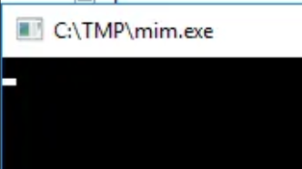

 Click on the File Explorer icon on the taskbar at the bottom of the screen. Once the File Explorer window pops up click on the Local Disk (C:) to open this directory.
 
 Once inside this directory, you will see several files, word docs, and powershell commandlets. If we look for the Application named mim.exe, like we keep seeing pop up, under it is a word document called mim-out. This could be related to the application, so let us open it and see. Double-click on mim-out.

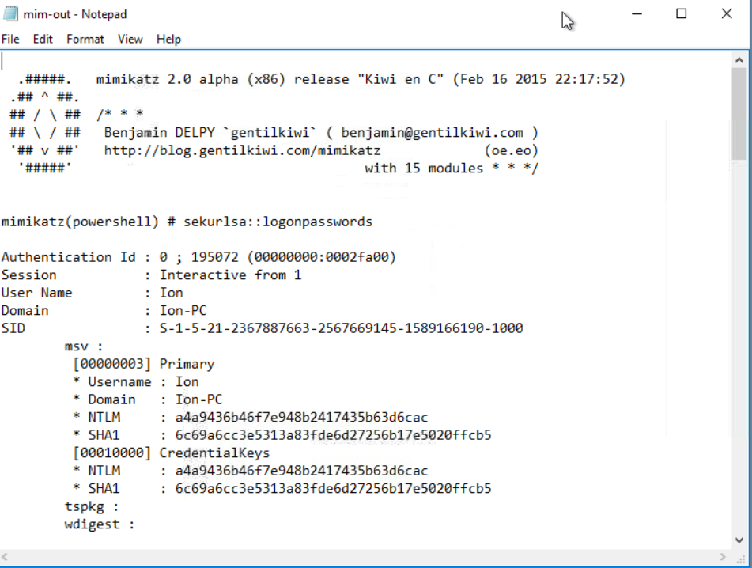

We can now see the name of the tool

ANS: mimikatz

13. Command & Control (C2) Server

    What was the attackers external control and command servers IP?
    
    Look through the host file, path:

           C:\Windows\System32\drivers\etc\hosts

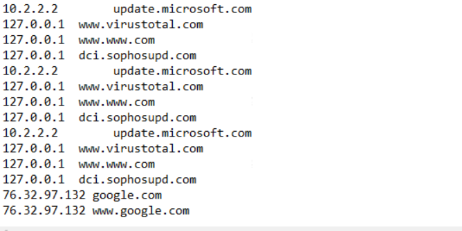

ANS: 76.32.97.132

14. extension name of the Web Shell Identification

Look for Local Disk (C:), under it should be the directory we are looking for, it is inetpub, click on it. 

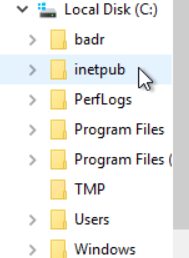

 Inside this directory is another directory named wwwroot, click on it to go into this directory.

 Now inside this directory we can see three files, two of which is .JSP files and the other is a .GIF file. The .GIF file isn’t super suspicious on a computer, but what is a .JSP file? In the question it does say what is the extention of the shell uploaded, but they are talking about the two other files.

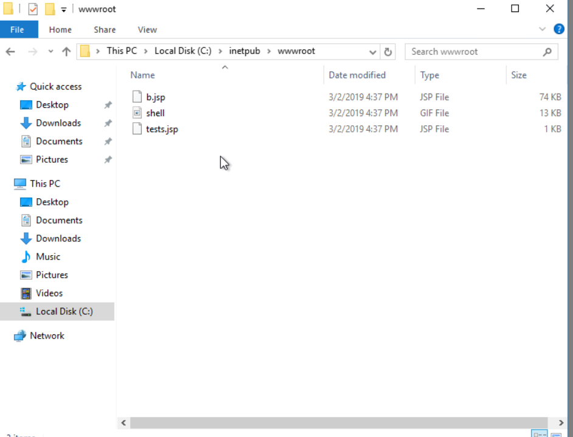

ANS: .jsp

15. Last port the attacker opened

    Check out the Firewall logs:

        Start → firewall → enter

    Click on Inbound Rules

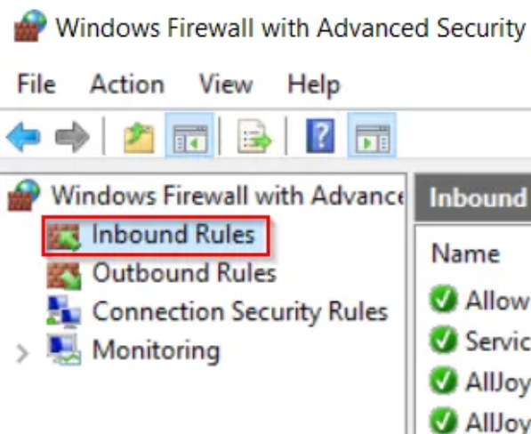

    Now, go to the column on the right hand side. Click on Filter by Group, then scroll to the bottom of the drop-down menu, click on Rules without a Group.

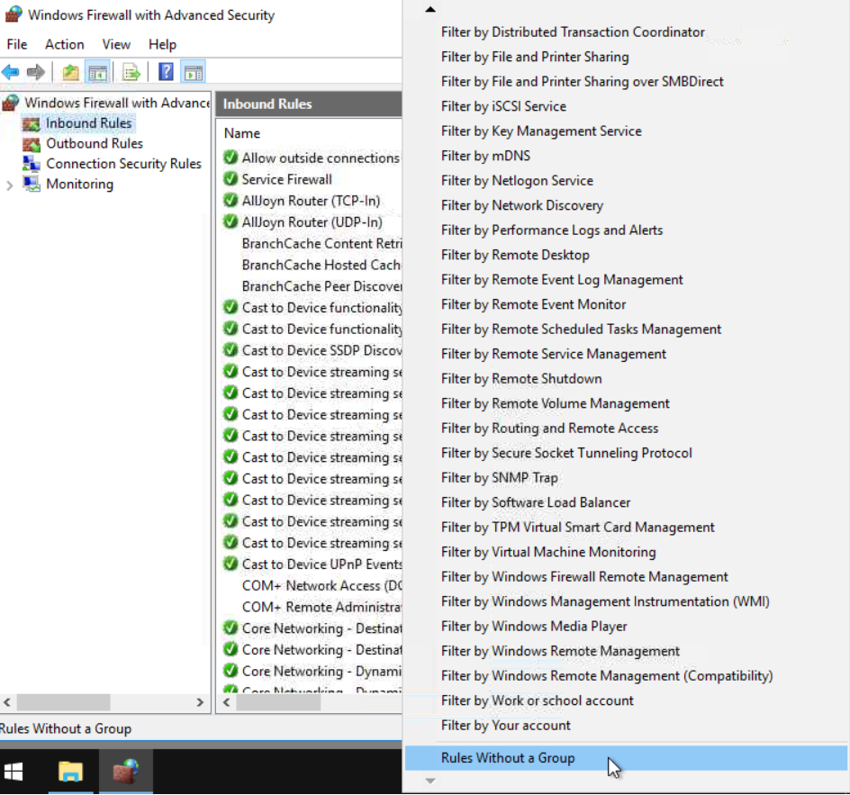

  We now have two results, one of them seems very sus. Double click on the first entry, Allow outside connections for development.
  
  click on Protocols and Ports. The port that is opened is give here

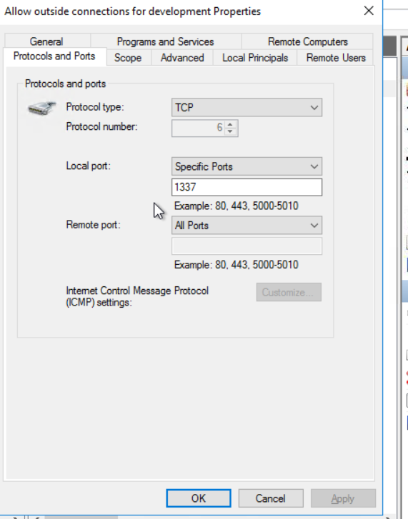

ANS: 1337

16. DNS Poisoning Detection

    Go back to the host file, path:

         C:\Windows\System32\drivers\etc\hosts

ANS: google.com

## Key Indicators of Compromise (IOCs)

| Category           | Indicator           | Description                          |
|-------------------|---------------------|--------------------------------------|
| Persistence       | Clean file system   | Malicious scheduled task             |
| Execution         | nc.ps1              | PowerShell backdoor script           |
| Network           | 1348                | Local listening port (backdoor)      |
| Command & Control | 76.32.97.132        | External attacker-controlled server  |
| Credential Access | Mimikatz            | Password dumping tool                |
| Initial Access    | .jsp                | Web shell uploaded to server         |
| Network           | 1337                | Suspicious port opened by attacker   |
| Impact            | google.com          | DNS poisoning target                 |

## Conclusion

The investigation revealed a full attack chain involving:

- Initial access via brute-force/login compromise
  
- Privilege escalation using administrative rights
  
- Credential dumping with Mimikatz
  
- Persistence via scheduled task
  
- Backdoor access through a PowerShell reverse shell
  
- Communication with an external C2 server
  
- DNS manipulation for traffic redirection

## Skills Demonstrated

- Windows log analysis
  
- Incident investigation
  
- Threat detection
  
- Persistence identification
  
- IOC extraction

## Notes

This lab highlights the importance of:

- Monitoring Event Logs
  
- Restricting administrative privileges
  
- Detecting unusual scheduled tasks
  
- Investigating outbound connections

          

